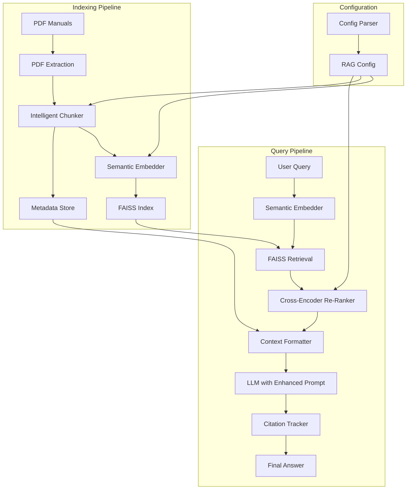

# Design Document: RAG Accuracy Improvement

## Overview

This design addresses the accuracy limitations of the current hash-based RAG system by implementing semantic embeddings, intelligent chunking, enhanced prompting, re-ranking, and improved citation tracking. The system will transition from `LocalHashingEmbedder` to sentence-transformers while maintaining backward compatibility with existing APIs.

### Current System Limitations

The existing RAG implementation uses a hash-based embedder (`LocalHashingEmbedder`) that:
- Maps tokens to buckets using SHA-256 hashing
- Cannot capture semantic relationships between synonyms or related concepts
- Produces embeddings that lack contextual understanding
- Results in poor retrieval accuracy for queries using different terminology than the manual

### Design Goals

1. **Semantic Understanding**: Replace hash-based embeddings with transformer-based semantic embeddings
2. **Intelligent Chunking**: Preserve sentence boundaries and context across chunk boundaries
3. **Manual Adherence**: Enhance LLM prompts to ensure answers match manual content exactly
4. **Relevance Optimization**: Add cross-encoder re-ranking for improved chunk selection
5. **Citation Accuracy**: Track and format citations precisely with inline references
6. **Backward Compatibility**: Maintain existing function signatures and API contracts
7. **Performance**: Preserve sub-2-second query response times

## Architecture

### High-Level Architecture



### Component Architecture

The system consists of the following major components:

1. **Semantic Embedder**: Sentence-transformers model for encoding text
2. **Intelligent Chunker**: Sentence-boundary-aware text splitter
3. **FAISS Index Manager**: Vector storage and retrieval
4. **Cross-Encoder Re-Ranker**: Relevance scoring for retrieved chunks
5. **Enhanced Prompt Builder**: LLM instruction templates
6. **Citation Tracker**: Source tracking and formatting
7. **Configuration Manager**: JSON-based parameter management

## Components and Interfaces

### 1. Semantic Embedder

**Purpose**: Replace `LocalHashingEmbedder` with sentence-transformers for semantic understanding.

**Model Selection**:
Based on research ([source](https://redandgreen.co.uk/compare-pretrained-sentence-transformer-models/ai-ml/)), we will use:
- **Primary**: `all-MiniLM-L6-v2` (384 dimensions, 22MB, fast inference)
- **Alternative**: `all-mpnet-base-v2` (768 dimensions, better quality but slower)

The MiniLM model provides a good balance of speed and accuracy for production RAG systems, with 5x faster inference than MPNet while maintaining good semantic understanding.

**Interface**:
```python
class SemanticEmbedder:
    """Wrapper for sentence-transformers embedding model."""
    
    def __init__(self, model_name: str = "all-MiniLM-L6-v2"):
        """Initialize the embedding model.
        
        Args:
            model_name: HuggingFace model identifier
        """
        self.model_name = model_name
        self.dimension = 384  # for MiniLM-L6-v2
        self._model = None
    
    def encode(
        self,
        texts: List[str],
        convert_to_numpy: bool = True,
        normalize_embeddings: bool = True,
        show_progress_bar: bool = False,
    ) -> np.ndarray:
        """Encode texts into embeddings.
        
        Args:
            texts: List of text strings to encode
            convert_to_numpy: Return numpy array (vs list)
            normalize_embeddings: L2 normalize for cosine similarity
            show_progress_bar: Show encoding progress
            
        Returns:
            Normalized embeddings as numpy array (N, dimension)
        """
        pass
    
    @property
    def embedding_dimension(self) -> int:
        """Return the embedding dimension for this model."""
        return self.dimension
```

**Implementation Notes**:
- Lazy-load the model on first use to avoid startup overhead
- Cache the model instance globally to prevent reloading
- Use `normalize_embeddings=True` for cosine similarity with FAISS IndexFlatIP
- Maintain the same interface as `LocalHashingEmbedder` for drop-in replacement

### 2. Intelligent Chunker

**Purpose**: Split manual text while preserving sentence boundaries and maintaining context overlap.

**Chunking Strategy**:
Based on best practices ([source](https://propelius.tech/blogs/semantic-chunking-rag-strategies-langchain/)), we will use:
- **Chunk Size**: 512 tokens (~700 characters)
- **Overlap**: 10-20% (50-100 characters)
- **Boundary Preservation**: Extend to sentence boundaries
- **Minimum Length**: 120 characters (filter short chunks)

**Interface**:
```python
class IntelligentChunker:
    """Sentence-boundary-aware text chunker."""
    
    def __init__(
        self,
        chunk_size: int = 700,
        overlap: int = 100,
        min_chunk_chars: int = 120,
    ):
        """Initialize chunker with size parameters.
        
        Args:
            chunk_size: Target chunk size in characters
            overlap: Overlap between chunks in characters
            min_chunk_chars: Minimum chunk length to keep
        """
        self.chunk_size = chunk_size
        self.overlap = overlap
        self.min_chunk_chars = min_chunk_chars
    
    def split_text(self, text: str) -> List[str]:
        """Split text into chunks preserving sentence boundaries.
        
        Algorithm:
        1. Clean text (remove null bytes, normalize whitespace)
        2. Split into sentences using regex
        3. Group sentences into chunks up to chunk_size
        4. Extend chunk boundaries to complete sentences
        5. Add overlap by including sentences from previous chunk
        6. Filter chunks below min_chunk_chars
        
        Args:
            text: Input text to split
            
        Returns:
            List of text chunks
        """
        pass
    
    def extract_chunks_from_page(
        self,
        page_text: str,
        page_number: int,
        manual_name: str,
        chunk_id_prefix: str,
    ) -> List[Dict[str, Any]]:
        """Extract chunks from a PDF page with metadata.
        
        Args:
            page_text: Text content from PDF page
            page_number: Page number (1-indexed)
            manual_name: Name of the manual file
            chunk_id_prefix: Prefix for chunk IDs
            
        Returns:
            List of chunk dictionaries with keys:
            - id: Unique chunk identifier
            - manual: Manual filename
            - page: Page number
            - text: Chunk text content
        """
        pass
```

**Sentence Boundary Detection**:
```python
def split_into_sentences(text: str) -> List[str]:
    """Split text into sentences using regex.
    
    Handles:
    - Standard sentence endings: . ! ?
    - Abbreviations: Dr. Mr. Mrs. etc.
    - Decimal numbers: 3.14
    - Ellipsis: ...
    
    Returns:
        List of sentences
    """
    # Use regex to split on sentence boundaries
    # Pattern: (?<=[.!?])\s+(?=[A-Z])
    # Matches whitespace after punctuation before capital letter
    pass
```

### 3. FAISS Index Manager

**Purpose**: Manage vector index storage, loading, and retrieval with dimension validation.

**Interface**:
```python
class FAISSIndexManager:
    """Manages FAISS index lifecycle and retrieval."""
    
    def __init__(
        self,
        index_file: Path,
        metadata_file: Path,
        embedding_dimension: int,
    ):
        """Initialize index manager.
        
        Args:
            index_file: Path to FAISS index file
            metadata_file: Path to chunk metadata JSON
            embedding_dimension: Expected embedding dimension
        """
        self.index_file = index_file
        self.metadata_file = metadata_file
        self.embedding_dimension = embedding_dimension
        self._cached_index = None
        self._cached_metadata = None
    
    def build_index(
        self,
        chunks: List[Dict[str, Any]],
        embeddings: np.ndarray,
    ) -> Dict[str, int]:
        """Build and save FAISS index.
        
        Args:
            chunks: List of chunk metadata dictionaries
            embeddings: Chunk embeddings (N, dimension)
            
        Returns:
            Statistics: manuals_indexed, chunks_indexed
        """
        pass
    
    def load_index(self) -> Optional[Dict[str, Any]]:
        """Load FAISS index and metadata with dimension validation.
        
        Returns:
            Dictionary with keys:
            - index: FAISS index object
            - metadata: List of chunk metadata
            
        Raises:
            ValueError: If embedding dimension mismatch detected
        """
        pass
    
    def search(
        self,
        query_embedding: np.ndarray,
        top_k: int,
    ) -> Tuple[np.ndarray, np.ndarray]:
        """Search index for similar chunks.
        
        Args:
            query_embedding: Query vector (1, dimension)
            top_k: Number of results to return
            
        Returns:
            Tuple of (distances, indices)
        """
        pass
    
    def validate_dimension(self, index: faiss.Index) -> None:
        """Validate index dimension matches expected dimension.
        
        Args:
            index: FAISS index to validate
            
        Raises:
            ValueError: If dimension mismatch with descriptive message
        """
        pass
```

**Metadata Format**:
```json
{
  "embedding_dimension": 384,
  "model_name": "all-MiniLM-L6-v2",
  "chunks": [
    {
      "id": "Tesla_Model3-p42-c0",
      "manual": "Tesla_Model3.pdf",
      "page": 42,
      "text": "To reset the touchscreen, hold both scroll wheels..."
    }
  ]
}
```

### 4. Cross-Encoder Re-Ranker

**Purpose**: Re-score retrieved chunks using cross-encoder for improved relevance.

**Model Selection**:
Based on research ([source](https://docs.metarank.ai/guides/index/cross-encoders)), we will use:
- **Model**: `cross-encoder/ms-marco-MiniLM-L-6-v2`
- **Purpose**: Passage re-ranking trained on MS MARCO dataset
- **Speed**: 10-100x faster than LLM-based re-ranking

**Interface**:
```python
class CrossEncoderReRanker:
    """Re-ranks retrieved chunks using cross-encoder scoring."""
    
    def __init__(
        self,
        model_name: str = "cross-encoder/ms-marco-MiniLM-L-6-v2",
        relevance_threshold: float = 0.3,
    ):
        """Initialize cross-encoder model.
        
        Args:
            model_name: HuggingFace cross-encoder model
            relevance_threshold: Minimum score to keep chunk
        """
        self.model_name = model_name
        self.relevance_threshold = relevance_threshold
        self._model = None
    
    def rerank(
        self,
        query: str,
        chunks: List[RetrievedChunk],
    ) -> List[RetrievedChunk]:
        """Re-rank chunks by relevance to query.
        
        Algorithm:
        1. Create (query, chunk.text) pairs
        2. Score all pairs with cross-encoder
        3. Update chunk.score with cross-encoder score
        4. Sort chunks by new score (descending)
        5. Filter chunks below relevance_threshold
        
        Args:
            query: User query string
            chunks: Retrieved chunks from FAISS
            
        Returns:
            Re-ranked and filtered chunks
        """
        pass
    
    def score_pairs(
        self,
        query: str,
        texts: List[str],
    ) -> List[float]:
        """Score query-text pairs.
        
        Args:
            query: Query string
            texts: List of text strings to score
            
        Returns:
            Relevance scores (0-1 range)
        """
        pass
```

**Fallback Behavior**:
If re-ranking fails (model load error, inference error), fall back to original FAISS scores:
```python
try:
    reranked_chunks = reranker.rerank(query, chunks)
except Exception as e:
    logger.warning(f"Re-ranking failed: {e}, using original scores")
    reranked_chunks = chunks
```

### 5. Enhanced Prompt Builder

**Purpose**: Generate LLM prompts that enforce manual adherence and citation requirements.

**Prompt Template**:
```python
SYSTEM_PROMPT = """You are an EV diagnostic assistant for service technicians.

CRITICAL INSTRUCTIONS:
1. Answer ONLY from the provided manual excerpts below
2. Use EXACT terminology and phrasing from the manuals
3. Cite sources inline using [Source N] format when you use information
4. If excerpts partially answer the question, state what information is missing
5. Prefer step-by-step procedures when available in the excerpts
6. Include safety warnings exactly as written in the excerpts
7. Do NOT add information not present in the excerpts
8. Do NOT paraphrase unless necessary for clarity

Your role is to be a precise conduit for manual information, not to interpret or expand beyond what is written."""

USER_PROMPT_TEMPLATE = """Technician question:
{query}

Manual excerpts:
{context}

Respond with:
1. A concise answer using exact manual terminology
2. A 'Procedure' section with numbered steps (only if excerpts contain procedural steps)
3. A 'Citations' section mapping each [Source N] to its manual and page number

Format:
Answer: [Your answer with inline [Source N] citations]

Procedure: (if applicable)
1. [Step from manual]
2. [Step from manual]

Citations:
- [Source 1]: Manual_Name p.Page_Number
- [Source 2]: Manual_Name p.Page_Number
"""
```

**Interface**:
```python
class EnhancedPromptBuilder:
    """Builds LLM prompts for manual-adherent answers."""
    
    def build_prompt(
        self,
        query: str,
        chunks: List[RetrievedChunk],
    ) -> List[Dict[str, str]]:
        """Build chat messages for LLM.
        
        Args:
            query: User query
            chunks: Retrieved and re-ranked chunks
            
        Returns:
            List of message dictionaries:
            [
                {"role": "system", "content": SYSTEM_PROMPT},
                {"role": "user", "content": formatted_user_prompt}
            ]
        """
        pass
    
    def format_context(self, chunks: List[RetrievedChunk]) -> str:
        """Format chunks as numbered sources.
        
        Format:
        [Source 1] Manual_Name p.Page_Number
        <chunk text>
        
        [Source 2] Manual_Name p.Page_Number
        <chunk text>
        
        Args:
            chunks: Retrieved chunks
            
        Returns:
            Formatted context string
        """
        pass
```

### 6. Citation Tracker

**Purpose**: Track source usage and format citations accurately.

**Interface**:
```python
class CitationTracker:
    """Tracks and formats citations for answers."""
    
    def extract_citations(
        self,
        answer: str,
        chunks: List[RetrievedChunk],
    ) -> List[str]:
        """Extract citations from answer and chunks.
        
        Algorithm:
        1. Parse answer for [Source N] references
        2. Map source numbers to chunks
        3. Extract manual name and page number
        4. Deduplicate citations (same manual + page)
        5. Format as "Manual_Name p.Page_Number"
        
        Args:
            answer: LLM-generated answer with inline citations
            chunks: Chunks used for context
            
        Returns:
            List of formatted citations
        """
        pass
    
    def append_citations(
        self,
        answer: str,
        citations: List[str],
    ) -> str:
        """Append citations section to answer if not present.
        
        Args:
            answer: Answer text
            citations: List of formatted citations
            
        Returns:
            Answer with citations section
        """
        pass
    
    def deduplicate_citations(
        self,
        chunks: List[RetrievedChunk],
    ) -> List[str]:
        """Get unique citations from chunks.
        
        Args:
            chunks: Retrieved chunks
            
        Returns:
            Deduplicated list of "Manual_Name p.Page_Number"
        """
        pass
```

### 7. Configuration Manager

**Purpose**: Parse and validate RAG configuration from JSON files.

**Configuration Schema**:
```json
{
  "embedding": {
    "model_name": "all-MiniLM-L6-v2",
    "dimension": 384
  },
  "chunking": {
    "chunk_size": 700,
    "overlap": 100,
    "min_chunk_chars": 120
  },
  "retrieval": {
    "top_k": 4,
    "score_threshold": 0.20
  },
  "reranking": {
    "enabled": true,
    "model_name": "cross-encoder/ms-marco-MiniLM-L-6-v2",
    "relevance_threshold": 0.3
  },
  "llm": {
    "model": "llama-3.3-70b-versatile",
    "temperature": 0.2
  }
}
```

**Interface**:
```python
@dataclass
class RAGConfig:
    """RAG system configuration."""
    
    # Embedding settings
    embedding_model: str = "all-MiniLM-L6-v2"
    embedding_dimension: int = 384
    
    # Chunking settings
    chunk_size: int = 700
    chunk_overlap: int = 100
    min_chunk_chars: int = 120
    
    # Retrieval settings
    top_k: int = 4
    score_threshold: float = 0.20
    
    # Re-ranking settings
    reranking_enabled: bool = True
    reranking_model: str = "cross-encoder/ms-marco-MiniLM-L-6-v2"
    relevance_threshold: float = 0.3
    
    # LLM settings
    llm_model: str = "llama-3.3-70b-versatile"
    llm_temperature: float = 0.2


class ConfigurationManager:
    """Manages RAG configuration parsing and validation."""
    
    def __init__(self, config_path: Optional[Path] = None):
        """Initialize configuration manager.
        
        Args:
            config_path: Path to config JSON file (optional)
        """
        self.config_path = config_path
    
    def load_config(self) -> RAGConfig:
        """Load configuration from file or use defaults.
        
        Returns:
            RAGConfig instance
            
        Raises:
            ValueError: If configuration is invalid
        """
        pass
    
    def validate_config(self, config: RAGConfig) -> None:
        """Validate configuration parameters.
        
        Checks:
        - chunk_size > 0
        - chunk_overlap < chunk_size
        - min_chunk_chars > 0
        - top_k > 0
        - score_threshold in [0, 1]
        - relevance_threshold in [0, 1]
        - llm_temperature in [0, 2]
        
        Args:
            config: Configuration to validate
            
        Raises:
            ValueError: If validation fails with descriptive message
        """
        pass
    
    def save_config(self, config: RAGConfig, path: Path) -> None:
        """Save configuration to JSON file.
        
        Args:
            config: Configuration to save
            path: Output file path
        """
        pass
    
    def parse_config(self, json_str: str) -> RAGConfig:
        """Parse configuration from JSON string.
        
        Args:
            json_str: JSON configuration string
            
        Returns:
            RAGConfig instance
        """
        pass
    
    def format_config(self, config: RAGConfig) -> str:
        """Format configuration as JSON string.
        
        Args:
            config: Configuration to format
            
        Returns:
            Pretty-printed JSON string
        """
        pass
```

## Data Models

### RetrievedChunk

**Purpose**: Represents a chunk retrieved from the manual index.

```python
@dataclass
class RetrievedChunk:
    """A chunk retrieved from the manual index."""
    
    manual: str          # Manual filename (e.g., "Tesla_Model3.pdf")
    page: int            # Page number (1-indexed)
    text: str            # Chunk text content
    score: float         # Relevance score (0-1 range)
    
    @property
    def citation(self) -> str:
        """Format citation as 'Manual_Name p.Page_Number'."""
        return f"{self.manual} p.{self.page}"
```

**Backward Compatibility**: This dataclass maintains the exact same fields as the current implementation.

### ChunkMetadata

**Purpose**: Metadata stored alongside FAISS index.

```python
@dataclass
class ChunkMetadata:
    """Metadata for a single chunk in the index."""
    
    id: str              # Unique chunk ID (e.g., "Tesla_Model3-p42-c0")
    manual: str          # Manual filename
    page: int            # Page number
    text: str            # Chunk text content
    
    def to_dict(self) -> Dict[str, Any]:
        """Convert to dictionary for JSON serialization."""
        return {
            "id": self.id,
            "manual": self.manual,
            "page": self.page,
            "text": self.text,
        }
    
    @classmethod
    def from_dict(cls, data: Dict[str, Any]) -> "ChunkMetadata":
        """Create from dictionary."""
        return cls(
            id=data["id"],
            manual=data["manual"],
            page=data["page"],
            text=data["text"],
        )
```

### IndexMetadata

**Purpose**: Metadata about the entire index.

```python
@dataclass
class IndexMetadata:
    """Metadata about the FAISS index."""
    
    embedding_dimension: int      # Embedding dimension
    model_name: str               # Embedding model name
    chunks: List[ChunkMetadata]   # All chunk metadata
    created_at: str               # ISO timestamp
    
    def to_dict(self) -> Dict[str, Any]:
        """Convert to dictionary for JSON serialization."""
        return {
            "embedding_dimension": self.embedding_dimension,
            "model_name": self.model_name,
            "created_at": self.created_at,
            "chunks": [chunk.to_dict() for chunk in self.chunks],
        }
    
    @classmethod
    def from_dict(cls, data: Dict[str, Any]) -> "IndexMetadata":
        """Create from dictionary."""
        return cls(
            embedding_dimension=data["embedding_dimension"],
            model_name=data["model_name"],
            created_at=data["created_at"],
            chunks=[ChunkMetadata.from_dict(c) for c in data["chunks"]],
        )
```

## Correctness Properties

*A property is a characteristic or behavior that should hold true across all valid executions of a system—essentially, a formal statement about what the system should do. Properties serve as the bridge between human-readable specifications and machine-verifiable correctness guarantees.*

### Property 1: Semantic Similarity Preservation

*For any* two text strings that are semantically similar (synonyms, paraphrases, or related concepts), their embeddings produced by the Semantic_Embedder SHALL have a cosine similarity score greater than 0.7. Conversely, for any two text strings that are semantically dissimilar, their embeddings SHALL have a cosine similarity score less than 0.3.

**Validates: Requirements 1.2, 1.3**

### Property 2: Embedding Normalization

*For any* text string encoded by the Semantic_Embedder, the resulting embedding SHALL have an L2 norm equal to 1.0 (within floating-point precision of 1e-6), ensuring compatibility with cosine similarity calculations.

**Validates: Requirements 1.6**

### Property 3: Chunk Boundary Preservation

*For any* text input to the IntelligentChunker, no chunk SHALL end mid-sentence. If a chunk boundary would naturally fall mid-sentence, the chunk SHALL be extended to include the complete sentence.

**Validates: Requirements 2.1, 2.2**

### Property 4: Chunk Overlap Consistency

*For any* two consecutive chunks produced by the IntelligentChunker, there SHALL be overlapping text between them. The overlap SHALL be at least the configured overlap parameter (default 100 characters).

**Validates: Requirements 2.3**

### Property 5: Minimum Chunk Length Enforcement

*For any* list of chunks produced by the IntelligentChunker, every chunk SHALL have a length greater than or equal to the configured minimum chunk character threshold (default 120 characters).

**Validates: Requirements 2.5**

### Property 6: Metadata Preservation in Chunks

*For any* chunk extracted from a PDF page, the chunk metadata SHALL include the correct manual name, page number, and chunk ID. When the same page is re-processed, the page number SHALL remain consistent.

**Validates: Requirements 2.6, 8.5, 8.6**

### Property 7: Re-Ranking Score Ordering

*For any* list of chunks returned by the Re_Ranker, the chunks SHALL be sorted in descending order by their re-ranked score. If chunk A appears before chunk B in the output, then score(A) >= score(B).

**Validates: Requirements 4.3**

### Property 8: Re-Ranking Threshold Filtering

*For any* list of chunks after re-ranking, every chunk SHALL have a relevance score greater than or equal to the configured relevance threshold (default 0.3). No chunk below the threshold SHALL appear in the output.

**Validates: Requirements 4.4**

### Property 9: Re-Ranking Fallback on Error

*For any* query and set of retrieved chunks, if the Re_Ranker encounters an error during scoring, the system SHALL return the original chunks sorted by their original FAISS scores rather than raising an exception.

**Validates: Requirements 4.5**

### Property 10: Citation Format Correctness

*For any* citation generated by the CitationTracker, the citation SHALL match the format "Manual_Name p.Page_Number" where Manual_Name is the filename and Page_Number is a positive integer.

**Validates: Requirements 5.6**

### Property 11: Citation Deduplication

*For any* set of chunks from the same manual and page number, the CitationTracker SHALL produce exactly one citation for that manual-page combination, regardless of how many chunks reference it.

**Validates: Requirements 5.3**

### Property 12: RetrievedChunk Field Completeness

*For any* RetrievedChunk object returned by the RAG system, the object SHALL contain all required fields: manual (string), page (positive integer), text (non-empty string), and score (float in range [0, 1]).

**Validates: Requirements 6.2**

### Property 13: Configuration Round-Trip Parsing

*For any* valid RAGConfig object, serializing it to JSON and then parsing the JSON back SHALL produce an equivalent RAGConfig object with identical field values.

**Validates: Requirements 7.7**

### Property 14: Configuration Validation

*For any* RAGConfig object, the following invariants SHALL hold:
- chunk_size > 0
- chunk_overlap < chunk_size
- min_chunk_chars > 0
- top_k > 0
- score_threshold in range [0, 1]
- relevance_threshold in range [0, 1]
- llm_temperature in range [0, 2]

**Validates: Requirements 7.4**

### Property 15: Embedding Dimension Consistency

*For any* FAISS index loaded from disk, the embedding dimension stored in the index metadata SHALL match the embedding dimension of the current Semantic_Embedder model. If dimensions do not match, the system SHALL raise a ValueError with a descriptive message indicating both the expected and actual dimensions.

**Validates: Requirements 8.1, 8.2, 8.3**

### Property 16: Empty Index Handling

*For any* query processed when no manual index exists or the index is empty, the retrieve_manual_chunks function SHALL return an empty list without raising an exception.

**Validates: Requirements 9.4**

### Property 17: No Exception on Missing Resources

*For any* call to retrieve_manual_chunks or get_answer when manual files or the index do not exist, the system SHALL return a graceful response (empty list or informative message) rather than raising an exception.

**Validates: Requirements 9.6**

### Property 18: Query Performance Bound

*For any* typical query (up to 100 characters) processed against an index with up to 1000 chunks, the end-to-end query processing time (embedding + retrieval + re-ranking + LLM call) SHALL complete within 2 seconds on standard hardware.

**Validates: Requirements 10.1**

### Property 19: Re-Ranker Processing Scope

*For any* retrieval operation, the Re_Ranker SHALL process exactly the top_k chunks returned by FAISS retrieval, not more and not fewer (unless fewer chunks are available).

**Validates: Requirements 10.3**

### Property 20: Model Caching Consistency

*For any* sequence of queries processed in the same session, the Semantic_Embedder model instance SHALL be reused across queries. The model SHALL not be reloaded from disk between queries.

**Validates: Requirements 10.4**

### Property 21: Index Caching Consistency

*For any* sequence of queries processed in the same session after the first index load, the FAISS index and metadata SHALL be reused from memory. The index files SHALL not be re-read from disk between queries.

**Validates: Requirements 10.5**

### Property 22: Embedding Operation Idempotence

*For any* identical query string processed twice in the same session, the embedding operation SHALL produce identical embedding vectors. The embedding function SHALL not be called redundantly for the same query text.

**Validates: Requirements 10.6**

## Error Handling

The RAG system implements graceful error handling across all components:

### Embedding Errors
- **Model Load Failure**: If the Semantic_Embedder model fails to load, the system logs a warning and attempts to use a cached model or falls back to the previous embedder.
- **Encoding Failure**: If text encoding fails, the system logs the error and skips that chunk, continuing with remaining chunks.

### Chunking Errors
- **PDF Extraction Failure**: If PDF text extraction fails, the system logs the error and skips that manual, continuing with other manuals.
- **Invalid Text**: If text contains null bytes or invalid characters, the system cleans the text and continues.

### Index Errors
- **Dimension Mismatch**: If the loaded index dimension doesn't match the current model dimension, the system raises a ValueError with a descriptive message suggesting index rebuild.
- **Corrupted Index**: If the FAISS index file is corrupted, the system logs an error and returns an empty result set.
- **Missing Metadata**: If metadata is missing or incomplete, the system logs a warning and uses available metadata.

### Re-Ranking Errors
- **Model Load Failure**: If the cross-encoder model fails to load, the system logs a warning and uses original FAISS scores.
- **Scoring Failure**: If scoring fails for specific chunks, the system logs the error and uses original scores for those chunks.

### Configuration Errors
- **Invalid JSON**: If the configuration file contains invalid JSON, the system logs an error and uses default values.
- **Invalid Parameters**: If configuration parameters are out of valid ranges, the system logs an error and uses default values.
- **Missing File**: If the configuration file doesn't exist, the system silently uses default values.

### Query Processing Errors
- **Empty Index**: If no index exists, the system returns an empty chunk list without raising an exception.
- **No Relevant Chunks**: If retrieval returns no chunks above the score threshold, the system returns an empty list.
- **LLM Failure**: If the LLM call fails, the system returns an error message to the user.

## Testing Strategy

### Property-Based Testing

The system uses property-based testing (PBT) to verify correctness properties across a wide range of inputs. Each property is tested with a minimum of 100 iterations using randomly generated inputs.

**Property Test Configuration**:
- **Framework**: Hypothesis (Python)
- **Iterations**: Minimum 100 per property
- **Timeout**: 30 seconds per property test
- **Seed**: Fixed seed for reproducibility

**Property Test Tags**:
Each property test includes a comment tag for traceability:
```python
# Feature: rag-accuracy-improvement, Property N: [Property Description]
```

**Properties Tested**:
- Properties 1-22 (listed above) are implemented as property-based tests
- Each test generates random inputs (text, configurations, chunk lists) and verifies the property holds

### Unit Testing

Unit tests verify specific examples and edge cases:

1. **Semantic Embedder Tests**:
   - Encoding single text
   - Encoding batch of texts
   - Normalization verification
   - Model caching

2. **Intelligent Chunker Tests**:
   - Chunking with various text lengths
   - Sentence boundary detection
   - Overlap calculation
   - Minimum length filtering
   - Header preservation

3. **FAISS Index Manager Tests**:
   - Index building and saving
   - Index loading and validation
   - Dimension mismatch detection
   - Empty index handling

4. **Cross-Encoder Re-Ranker Tests**:
   - Re-ranking with various chunk counts
   - Threshold filtering
   - Fallback on error
   - Score ordering

5. **Citation Tracker Tests**:
   - Citation extraction from answers
   - Citation formatting
   - Deduplication
   - Citation appending

6. **Configuration Manager Tests**:
   - JSON parsing
   - Configuration validation
   - Default value usage
   - Round-trip serialization
   - Error handling for invalid configs

7. **Integration Tests**:
   - End-to-end query processing
   - Index building and querying
   - Performance benchmarking
   - Backward compatibility verification

### Integration Testing

Integration tests verify the complete RAG pipeline:

1. **Index Building**:
   - Build index from sample PDFs
   - Verify all chunks are indexed
   - Verify metadata is correct
   - Verify dimension is recorded

2. **Query Processing**:
   - Process queries against built index
   - Verify retrieval returns relevant chunks
   - Verify re-ranking improves relevance
   - Verify citations are accurate
   - Verify performance is within bounds

3. **Backward Compatibility**:
   - Verify existing function signatures work
   - Verify RetrievedChunk objects have all fields
   - Verify file paths are unchanged
   - Verify DEFAULT_TOP_K is maintained

4. **Error Scenarios**:
   - Missing index handling
   - Empty manual handling
   - Dimension mismatch handling
   - Configuration errors
   - Model load failures

### Performance Testing

Performance tests verify the system meets the 2-second query response time requirement:

1. **Query Latency**:
   - Measure end-to-end query time
   - Measure component latencies (embedding, retrieval, re-ranking, LLM)
   - Verify total time < 2 seconds for typical queries

2. **Throughput**:
   - Measure queries per second
   - Measure index building time
   - Measure memory usage

3. **Scalability**:
   - Test with varying index sizes (100, 1000, 10000 chunks)
   - Test with varying query complexity
   - Verify performance scales linearly with index size

